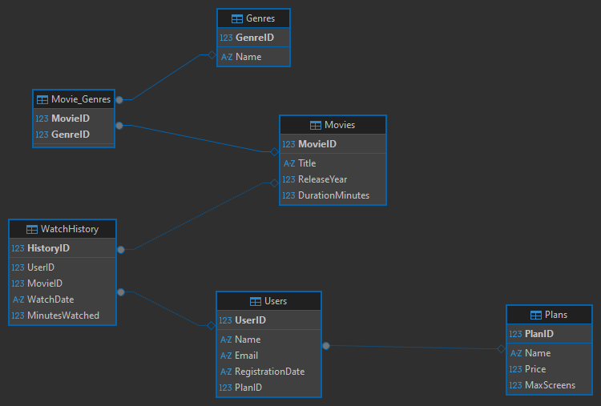

# 🎬 Plataforma de Streaming - Projeto de Banco de Dados Relacional

## 📖 Sobre o Projeto
Este projeto simula o banco de dados relacional de uma plataforma de streaming de vídeos (estilo Netflix/Amazon Prime). O objetivo é demonstrar a modelagem de dados e a criação de consultas analíticas para responder a problemas reais de negócio.

## 🛠️ Tecnologias e Ferramentas
* **Banco de Dados:** SQLite (escolhido pela portabilidade)
* **Ferramenta de Gestão:** DBeaver
* **Linguagem:** SQL (DDL, DML, DQL)

## 🗂️ Estrutura do Banco de Dados (Modelagem)
O banco foi normalizado para evitar redundâncias e garantir a integridade dos dados. Ele contém tabelas cruciais como Usuários, Planos de Assinatura, Filmes, Gêneros e um Histórico de Visualização.

Lidamos também com relacionamentos **Muitos-para-Muitos** (M:N) utilizando uma tabela associativa entre Filmes e Gêneros.

## 🚀 Como Executar este Projeto
1. Clone este repositório.
2. Abra o DBeaver e crie uma nova conexão SQLite apontando para o arquivo `streaming_db.sqlite` (ou crie um novo banco vazio).
3. Execute os scripts na seguinte ordem:
   - `01_schema.sql`: Para criar as tabelas estruturais.
   - `02_mock_data.sql`: Para popular o banco com dados de teste.
   - `03_business_queries.sql`: Para visualizar as consultas analíticas e operações de CRUD.

## 📊 Consultas de Destaque
Ao longo do desenvolvimento, criei consultas complexas utilizando `JOINs`, Funções de Agregação (`SUM()`, `GROUP BY`) e regras de integridade (Foreign Keys). 

Exemplo de pergunta de negócio respondida no código:
> *"Qual é o gênero de filme mais consumido em nossa plataforma, baseado no tempo de visualização dos usuários?"*

---
*Desenvolvido por Leonardo Mendes de Andrade Silva - Conecte-se comigo no https://www.linkedin.com/in/leonardo-mendes-1b31a31a2 *
